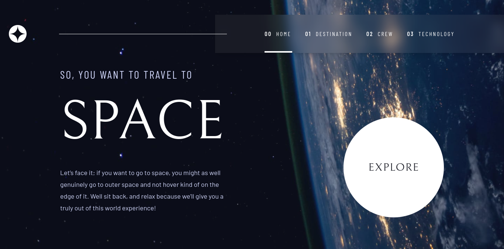
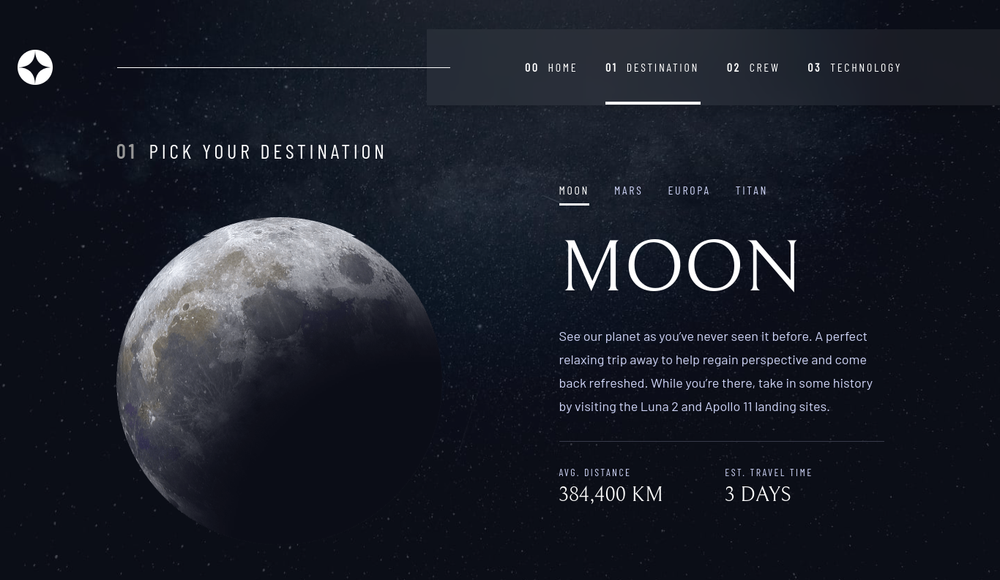
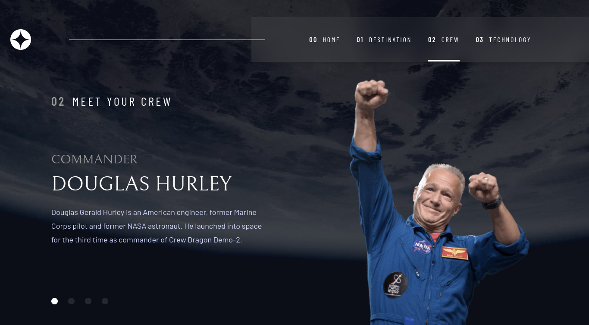
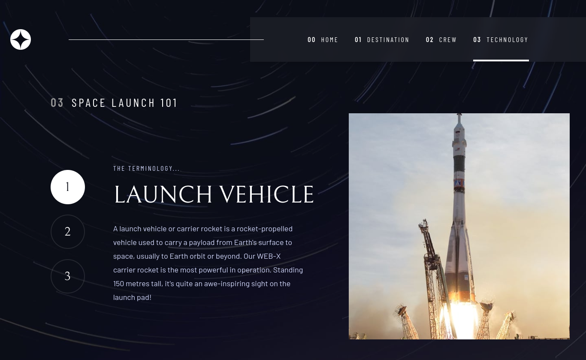

# Space tour

## Table of contents

- [Overview](#overview)
  - [The challenge](#the-challenge)
  - [Screenshot](#screenshot)
  - [Links](#links)
- [My process](#my-process)
  - [Built with](#built-with)
  - [What I learned](#what-i-learned)
  - [Continued development](#continued-development)
  - [Useful resources](#useful-resources)

## Overview

### The challenge

Users should be able to:

- View the optimal layout for each of the website's pages depending on their device's screen size
- See hover states for all interactive elements on the page
- View each page and be able to toggle between the tabs to see new information

### Screenshot

#### Home

#### Destination

#### Crew

#### Technology

### Links

- Live Site URL: [Live Site](https://space-tour-iota.vercel.app/)

## My process

### Built with

- Semantic HTML5 markup
- Flexbox
- Mobile-first workflow
- [React](https://reactjs.org/) - JS library
- [Tailwind CSS](https://tailwindcss.com/) - React framework
- React Router

### What I learned

This was a very fun project to do as I wanted to get familiar with using react router and learning how it works.
I'm definetely not solid in it yet so i'm going to be developing more projects until I can get a firm grasp on it.

### Continued development
- Develop more projects involving the use of react router

### Useful resources

- [webdevsimplified tutorial on react router](https://blog.webdevsimplified.com/2022-07/react-router/) - This was a very quick video to understand the basics of react router and get started on a project
